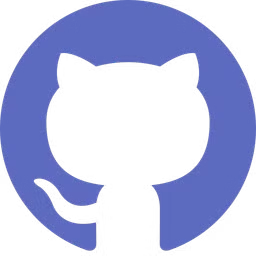
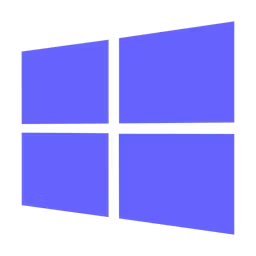

# ⛩️ Wendrews Botelho ⛩️ 

## 🏷️ Sobre mim:

Graduando do curso de Licenciatura em Computação, pela Universidade do Estado do Amazonas- UEA
Iniciei os meus estudos na área de computação em 2014 , no Instituto Federal do Amazonas- IFAM campus Parintins -Am, cursando Técnico em Informática. Atualmente sou Bolsista do Programa Residência Pedagógica - Capes.

*Uso o GitHub para documentação de estudos e projetos voltados para o aprendizado*

## 🧠 Conhecimentos:

|IDE|Linguagens de Programação|Marcação|Banco de Dados|
|--|--|--|--|
|||||

|Ferramentas|APIs|
|--|--|
|||

## 🎓 Certificados:

|Bootcamps Concluidos|
|--|
||

|Formações Concluidas|CodeCamps Concluidos|Cursos Concluidos|
|--|--|--|
||||

## ⚙️ Repositórios de Projetos

---
